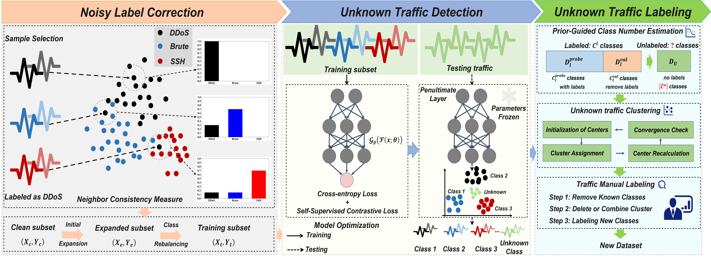

# Sieve

**Fine-grained Unknown Encrypted Malicious Traffic Detection and Analysis Learning from Mixed Noisy Labels**



## Introduction

In this paper, we introduce **Sieve**, a robust framework designed for the fine-grained detection and analysis of unknown encrypted malicious traffic in mixed noise conditions. Sieve consists of three collaborative modules:

1. **Noise-Resilient Label Correction Module**: Filters out mixed noise using neighbor consistency metrics and confidence-based subset expansion
2. **Post-hoc Detection Module**: Employs Mahalanobis distance in a purified, compact feature space to identify unknown traffic
3. **Unknown Traffic Labeling Module**: Utilizes semi-supervised clustering to facilitate efficient updates of the dataset

## Requirements

```
torch==2.1.1
numpy==1.26.1
scikit-learn==1.7.2
pandas==2.1.3
tqdm==4.67.1
matplotlib==3.8.2
```

Full dependencies: see `requirements.txt`

## Datasets

Coming soon!

## Using Sieve

### 1. Training (`train.py`)

Train the noise-resilient classifier on encrypted traffic data with mixed noisy labels.

```bash
python train.py \
    --dataset malicious_tls \
    --noisy_dataset TLS1.3 \
    --noise_ratio 0.5 \
    --open_ratio 0.5 \
    --noise_mode sym \
    --epochs 100 \
    --batch_size 256 \
    --lr 0.001
```

### 2. Unknown Traffic Detection (`unknown_traffic_detect.py`)

Detect unknown/OOD traffic using the trained model with Mahalanobis distance-based scoring.

```bash
python unknown_traffic_detect.py \
    --dataset malicious_tls \
    --noisy_dataset TLS1.3 \
    --noise_ratio 0.5 \
    --open_ratio 0.5
```


### 3. Unknown Traffic Labeling (`Unknown_Traffic_Labeling/`)

Label detected unknown traffic using semi-supervised clustering.

**Step 1: Save OOD samples**
```bash
cd Unknown_Traffic_Labeling

python save_ood_samples.py \
    --dataset malicious_tls \
    --noisy_dataset TLS1.3 \
    --noise_ratio 0.1 \
    --open_ratio 0.5
```

**Step 2: Run GCD pipeline**
```bash
python run_gcd_pipeline.py \
    --dataset malicious_tls \
    --noisy_dataset TLS1.3 \
    --noise_ratio 0.1 \
    --open_ratio 0.5 \
    --max_K 100
```

**Evaluation Metrics:**
- AKS: Accuracy on Known/Seen classes
- ANS: Accuracy on Novel/Seen classes  
- HCA: Harmonic Clustering Accuracy
- NMI: Normalized Mutual Information
- ARI: Adjusted Rand Index

## Project Structure

```
Sieve/
├── train.py                      # Training script
├── unknown_traffic_detect.py     # Unknown traffic detection
├── Unknown_Traffic_Labeling/     # Unknown traffic labeling module
│   ├── save_ood_samples.py
│   ├── run_gcd_pipeline.py
│   └── novel_category_discovery.py
├── models/
│   └── preresnet.py              # DeepResNet model
├── datasets/
│   └── dataloader_tls.py         # Data loading utilities
├── utils/                        # Utility functions
├── logs/                         # Training logs and checkpoints
└── cache/                        # Dataset cache files
```
